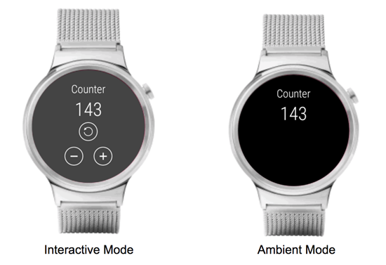
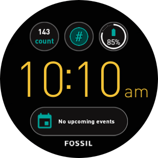

Counter
=========

## Standalone app for Android Wear 2.0

Count and keep track of anything on your watch.

Display the current count in a complication on your watch face, so you always have the info you need right on your wrist:

This serves as an example project for creating a standalone app for Android Wear 2.0.  The app also provides data to Android Wear 2.0 complications, and demonstrates how to set up complication tap actions.

[Download the app here on the Google Play Store](https://play.google.com/store/apps/details?id=com.buoybit.smspence.counter)

